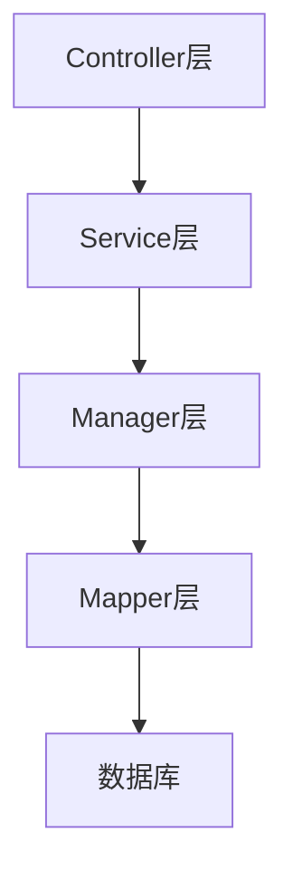
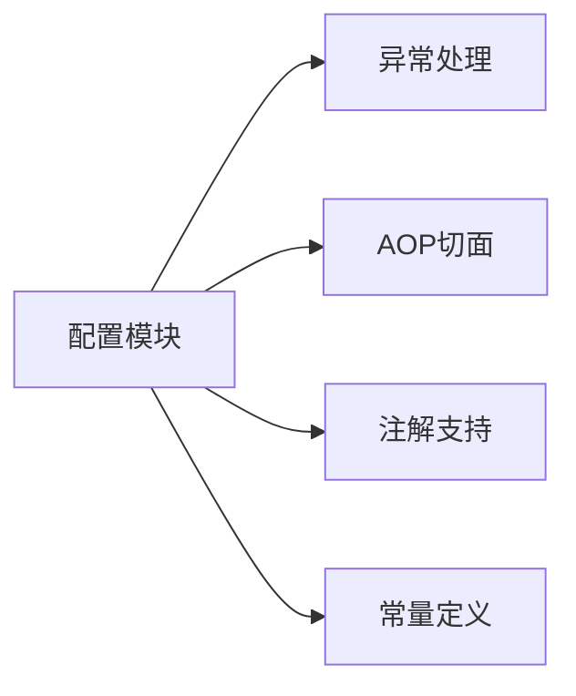
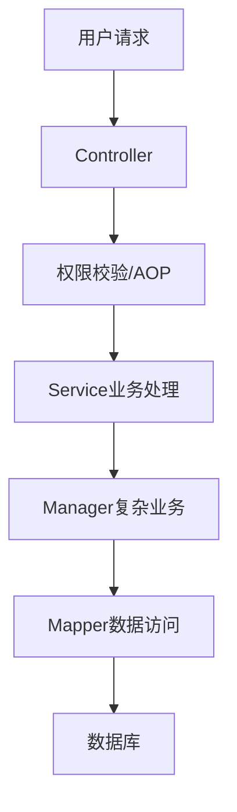
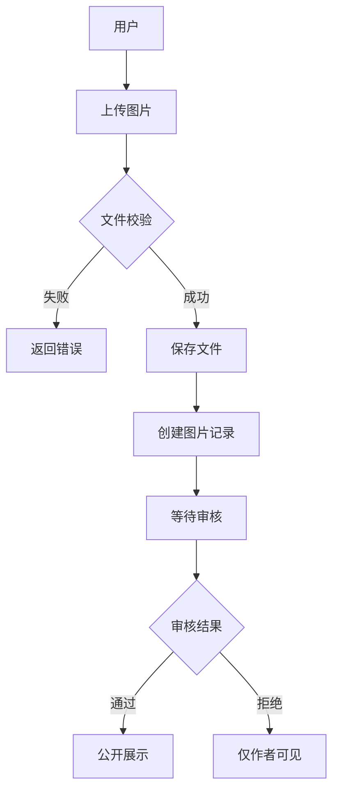
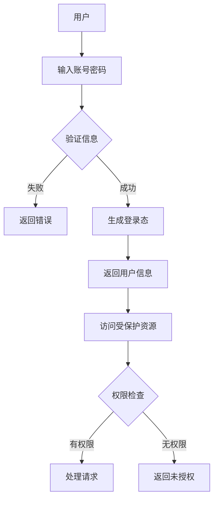
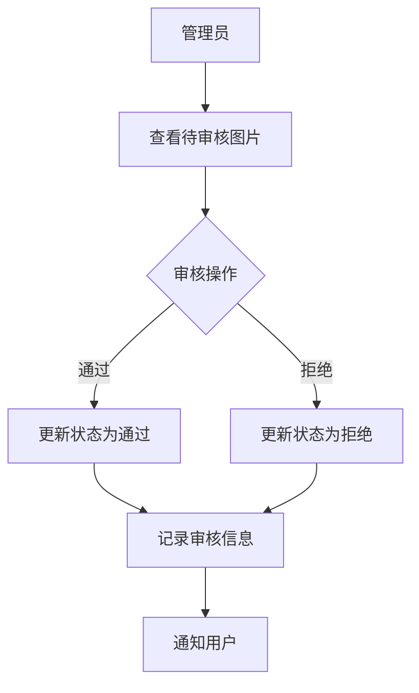
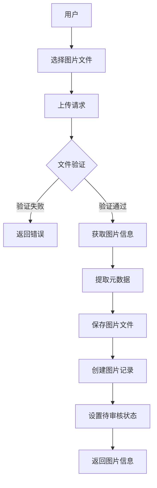
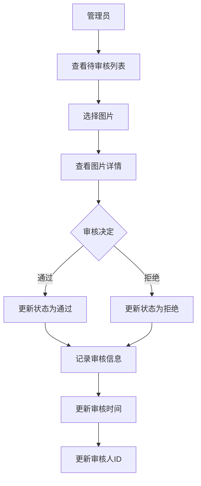
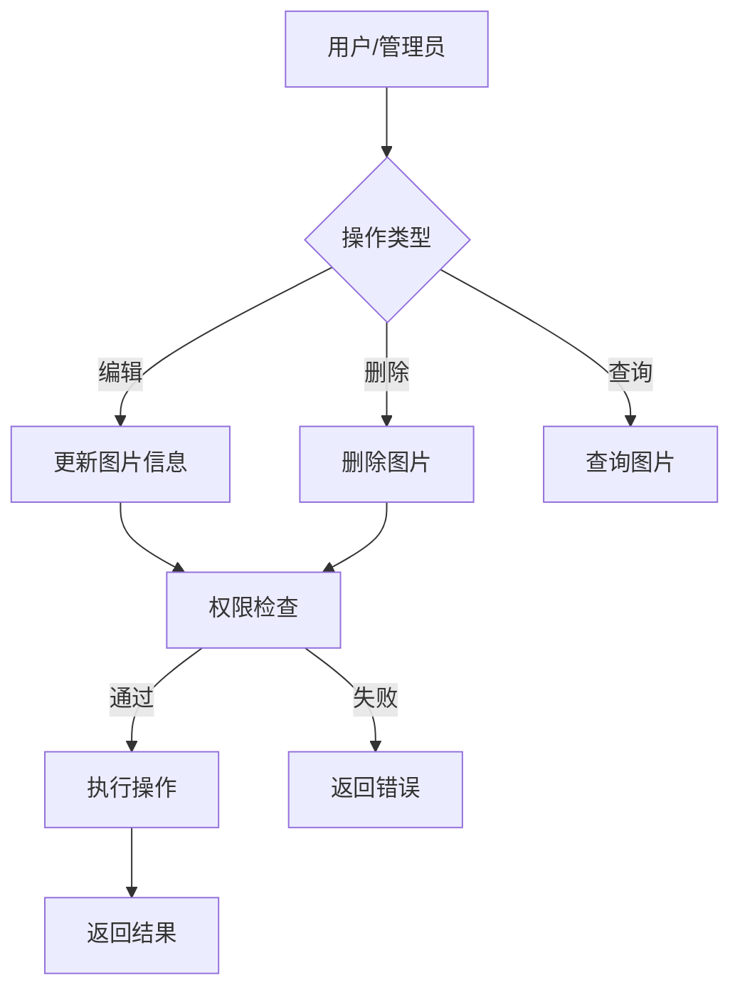
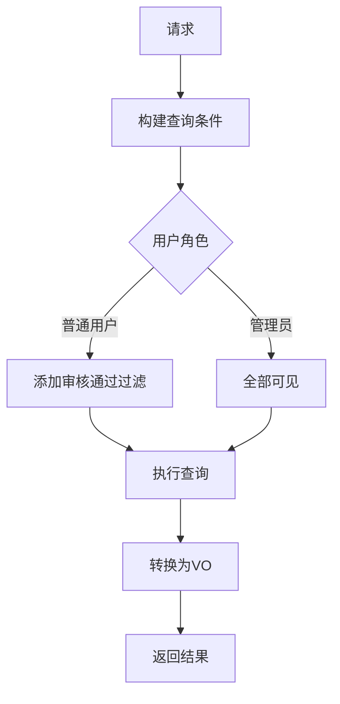

# 腾图片后端项目结构分析

## 1. 项目架构

这是一个基于 Spring Boot 的后端项目，采用了经典的多层架构设计。项目名为"腾图片后端"(Teng Picture Backend)，主要是一个图片处理相关的服务。

### 架构流程图



## 2. 核心目录结构

```markdown
📦 teng-picture-backend
├── 📂 src/main/java/com/zhongyuan/tengpicturebackend
│ ├── 📂 controller // 控制器层：处理 HTTP 请求
│ ├── 📂 service // 服务层：业务逻辑处理
│ ├── 📂 model // 数据模型：实体类
│ ├── 📂 manager // 管理层：复杂业务处理
│ ├── 📂 mapper // 数据访问层：MyBatis 映射
│ ├── 📂 config // 配置类
│ ├── 📂 aop // 面向切面编程
│ ├── 📂 annotation // 自定义注解
│ ├── 📂 constant // 常量定义
│ ├── 📂 common // 公共组件
│ └── 📂 exception // 异常处理
├── 📂 resources // 配置文件
└── 📂 sql // 数据库脚本
```

## 3. 技术栈分析

1. **核心框架**：Spring Boot
2. **持久层**：MyBatis
3. **数据库**：MySQL
4. **项目构建**：Maven
5. **切面编程**：Spring AOP

## 4. 功能模块划分

### 4.1 基础架构模块



### 4.2 业务流程



## 5. 关键特性

1. **AOP 切面**：

   - 位于 `aop` 包下
   - 可能用于日志记录、权限验证、性能监控等横切关注点

2. **自定义注解**：

   - 位于 `annotation` 包下
   - 用于功能标记和行为控制

3. **异常处理**：

   - 统一的异常处理机制
   - 规范的错误响应

4. **通用组件**：
   - 位于 `common` 包下
   - 包含工具类和通用功能

## 6. 代码规范和最佳实践

1. **分层架构**：

   - 清晰的职责划分
   - 良好的代码组织

2. **统一异常处理**：

   - 集中的异常处理机制
   - 标准化的错误响应

3. **配置管理**：
   - 集中的配置类管理
   - 环境隔离

## 7. 建议改进方向

1. **文档完善**：

   - 添加详细的 API 文档
   - 完善开发文档

2. **测试覆盖**：

   - 增加单元测试
   - 添加集成测试

3. **性能优化**：

   - 添加缓存机制
   - 优化数据库访问

4. **安全加强**：
   - 完善权限控制
   - 加强数据验证

## 8. 接口说明和业务流程

### 8.1 用户模块 (UserController)

#### 8.1.1 数据模型

- **DTO (Data Transfer Object)**

  - `UserRegisterRequest`: 用户注册请求参数
  - `UserLoginRequest`: 用户登录请求参数
  - `UserAddRequest`: 管理员添加用户请求参数
  - `UserUpdateRequest`: 用户信息更新请求参数
  - `UserQueryRequest`: 用户查询请求参数

- **VO (View Object)**
  - `LoginUserVo`: 登录用户视图对象，包含脱敏后的用户信息
  - `UserVo`: 用户信息视图对象

#### 8.1.2 接口清单

1. **用户注册**

   ```
   POST /user/register
   ```

   - 功能：新用户注册
   - 参数：UserRegisterRequest
   - 返回：用户 ID
   - 流程：
     1. 参数校验
     2. 密码加密
     3. 创建用户
     4. 返回用户 ID

2. **用户登录**

   ```
   POST /user/login
   ```

   - 功能：用户登录
   - 参数：UserLoginRequest
   - 返回：LoginUserVo
   - 流程：
     1. 参数校验
     2. 密码验证
     3. 记录登录态
     4. 返回脱敏用户信息

3. **获取当前登录用户**

   ```
   GET /user/get/login
   ```

   - 功能：获取当前登录用户信息
   - 返回：LoginUserVo

4. **用户注销**

   ```
   POST /user/logout
   ```

   - 功能：用户注销登录
   - 流程：清除登录态

5. **管理员接口**
   ```
   POST /user/add          # 添加用户
   GET /user/get          # 获取用户信息
   POST /user/delete      # 删除用户
   POST /user/update      # 更新用户信息
   POST /user/list/page/vo # 分页获取用户列表
   ```

### 8.2 图片模块 (PictureController)

#### 8.2.1 数据模型

- **DTO**

  - `PictureUploadRequest`: 图片上传请求
  - `PictureUpdateRequest`: 图片更新请求
  - `PictureQueryRequest`: 图片查询请求
  - `PictureReviewRequest`: 图片审核请求
  - `PictureEditRequest`: 图片编辑请求

- **VO**
  - `PictureVo`: 图片信息视图对象
  - `PictureTagCategory`: 图片标签和分类

#### 8.2.2 接口清单

1. **图片上传**

   ```
   POST /picture/upload
   ```

   - 功能：上传新图片
   - 参数：MultipartFile, PictureUploadRequest
   - 返回：PictureVo
   - 流程：
     1. 文件校验
     2. 上传处理
     3. 保存图片信息
     4. 返回图片视图

2. **图片管理**

   ```
   POST /picture/update   # 更新图片信息（管理员）
   GET /picture/get      # 获取图片详情（管理员）
   POST /picture/delete  # 删除图片
   POST /picture/review  # 审核图片（管理员）
   POST /picture/edit    # 编辑图片
   ```

3. **图片查询**
   ```
   GET /picture/get/vo           # 获取图片详情
   POST /picture/list/page/vo    # 分页查询图片
   GET /picture/tag_category     # 获取标签和分类
   ```

### 8.3 业务流程图

#### 8.3.1 图片上传流程



#### 8.3.2 用户认证流程



#### 8.3.3 图片审 ��� 流程



## 9. 图片模块详细业务流程

### 9.1 数据结构

#### 9.1.1 核心实体（Picture）

```java
public class Picture {
    private Long id;                // 图片ID
    private String url;            // 图片URL
    private String name;           // 图片名称
    private String introduction;   // 图片简介
    private String category;       // 分类
    private String tags;          // 标签（JSON数组）
    private Long picSize;         // 图片大小
    private Integer picWidth;     // 宽度
    private Integer picHeight;    // 高度
    private Double picScale;      // 宽高比
    private String picFormat;     // 图片格式
    private Long userId;          // 创建用户ID
    private Integer reviewStatus; // 审核状态（0-待审核,1-通过,2-拒绝）
    private String reviewMessage; // 审核信息
    private Long reviewerId;      // 审核人ID
    private Date reviewTime;      // 审核时间
    private Date createTime;      // 创建时间
    private Date editTime;        // 编辑时间
    private Date updateTime;      // 更新时间
}
```

### 9.2 详细业务流程

#### 9.2.1 图片上传流程



**详细步骤**：

1. **文件验证**

   - 检查文件大小
   - 验证文件格式
   - 校验文件完整性

2. **元数据提取**

   - 获取图片尺寸
   - 计算宽高比
   - 获取文件格式
   - 记录文件大小

3. **数据存储**
   - 保存图片文件到存储系统
   - 生成访问 URL
   - 创建数据库记录

#### 9.2.2 图片审核流程



**审核状态流转**：

- 待审核(0) -> 通过(1)
- 待审核(0) -> 拒绝(2)

#### 9.2.3 图片管理流程



**权限控制**：

1. 普通用户
   - 只能操作自己的图片
   - 只能查看已审核通过的图片
2. 管理员
   - 可以操作所有图片
   - 可以查看所有状态的图片

#### 9.2.4 图片查询流程



**查询参数**：

- 分类筛选
- 标签筛选
- 创建时间范围
- 审核状态
- 关键词搜索

### 9.3 关键业务规则

1. **图片格式控制**

   - 支持的格式：JPG、PNG、GIF 等
   - 最大文件大小限制
   - 图片尺寸限制

2. **审核机制**

   - 所有上传图片默认待审核
   - 只有管理员可以进行审核
   - 审核需要记录操作人和时间

3. **权限控制**

   - 基于用户角色的访问控制
   - 操作权限验证
   - 数据访问范围控制

4. **数据展示**
   - 分页查询
   - 条件过滤
   - 排序支持

### 9.4 异常处理

1. **上传异常**

   - 文件格式错误
   - 文件大小超限
   - 存储失败

2. **业务异常**

   - 权限不足
   - 资源不存在
   - 参数错误

3. **系统异常**
   - 服务器错误
   - 存储系统异常
   - 数据库异常

### 优化点
1. 图片查询优化：
   - redis 缓存优化
   - 本地缓存优化(等待实现)
