# 腾图片后端项目结构分析

## 1. 项目架构

这是一个基于 Spring Boot 的后端项目，采用了经典的多层架构设计。项目名为"腾图片后端"(Teng Picture Backend)，主要是一个图片处理相关的服务。

### 架构流程图

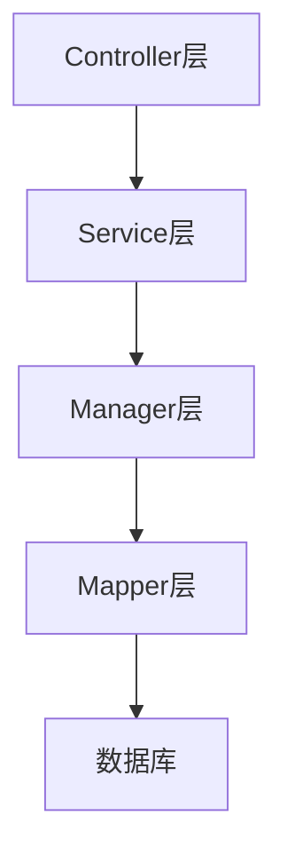

## 2. 核心目录结构

```markdown
📦 teng-picture-backend
├── 📂 src/main/java/com/zhongyuan/tengpicturebackend
│ ├── 📂 controller // 控制器层：处理 HTTP 请求
│ ├── 📂 service // 服务层：业务逻辑处理
│ ├── 📂 model // 数据模型：实体类
│ ├── 📂 manager // 管理层：复杂业务处理
│ ├── 📂 mapper // 数据访问层：MyBatis 映射
│ ├── 📂 config // 配置类
│ ├── 📂 aop // 面向切面编程
│ ├── 📂 annotation // 自定义注解
│ ├── 📂 constant // 常量定义
│ ├── 📂 common // 公共组件
│ └── 📂 exception // 异常处理
├── 📂 resources // 配置文件
└── 📂 sql // 数据库脚本
```

## 3. 技术栈分析

1. **核心框架**：Spring Boot
2. **持久层**：MyBatis
3. **数据库**：MySQL
4. **项目构建**：Maven
5. **切面编程**：Spring AOP

## 4. 功能模块划分

### 4.1 基础架构模块

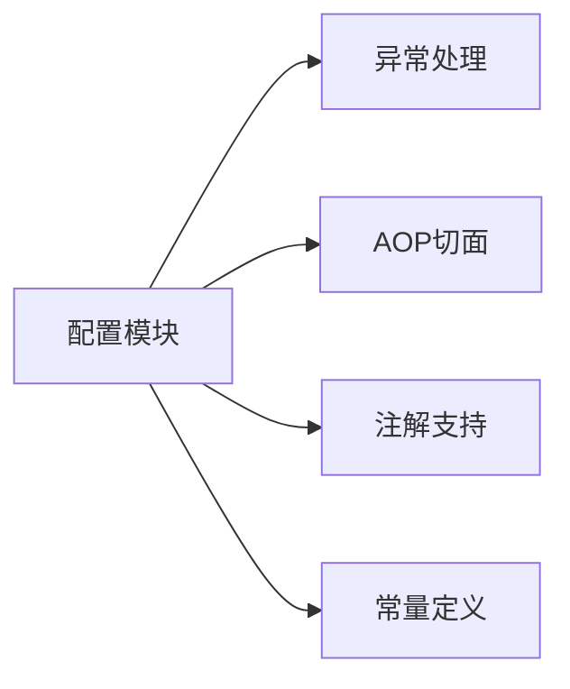

### 4.2 业务流程

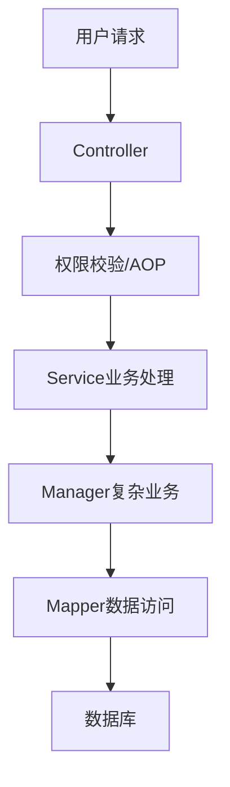

## 5. 关键特性

1. **AOP 切面**：

   - 位于 `aop` 包下
   - 可能用于日志记录、权限验证、性能监控等横切关注点

2. **自定义注解**：

   - 位于 `annotation` 包下
   - 用于功能标记和行为控制

3. **异常处理**：

   - 统一的异常处理机制
   - 规范的错误响应

4. **通用组件**：
   - 位于 `common` 包下
   - 包含工具类和通用功能

## 6. 代码规范和最佳实践

1. **分层架构**：

   - 清晰的职责划分
   - 良好的代码组织

2. **统一异常处理**：

   - 集中的异常处理机制
   - 标准化的错误响应

3. **配置管理**：
   - 集中的配置类管理
   - 环境隔离

## 7. 建议改进方向

1. **文档完善**：

   - 添加详细的 API 文档
   - 完善开发文档

2. **测试覆盖**：

   - 增加单元测试
   - 添加集成测试

3. **性能优化**：

   - 添加缓存机制
   - 优化数据库访问

4. **安全加强**：
   - 完善权限控制
   - 加强数据验证

## 8. 接口说明和业务流程

### 8.1 用户模块 (UserController)

#### 8.1.1 数据模型

- **DTO (Data Transfer Object)**

  - `UserRegisterRequest`: 用户注册请求参数
  - `UserLoginRequest`: 用户登录请求参数
  - `UserAddRequest`: 管理员添加用户请求参数
  - `UserUpdateRequest`: 用户信息更新请求参数
  - `UserQueryRequest`: 用户查询请求参数

- **VO (View Object)**
  - `LoginUserVo`: 登录用户视图对象，包含脱敏后的用户信息
  - `UserVo`: 用户信息视图对象

#### 8.1.2 接口清单

1. **用户注册**

   ```
   POST /user/register
   ```

   - 功能：新用户注册
   - 参数：UserRegisterRequest
   - 返回：用户 ID
   - 流程：
     1. 参数校验
     2. 密码加密
     3. 创建用户
     4. 返回用户 ID

2. **用户登录**

   ```
   POST /user/login
   ```

   - 功能：用户登录
   - 参数：UserLoginRequest
   - 返回：LoginUserVo
   - 流程：
     1. 参数校验
     2. 密码验证
     3. 记录登录态
     4. 返回脱敏用户信息

3. **获取当前登录用户**

   ```
   GET /user/get/login
   ```

   - 功能：获取当前登录用户信息
   - 返回：LoginUserVo

4. **用户注销**

   ```
   POST /user/logout
   ```

   - 功能：用户注销登录
   - 流程：清除登录态

5. **管理员接口**
   ```
   POST /user/add          # 添加用户
   GET /user/get          # 获取用户信息
   POST /user/delete      # 删除用户
   POST /user/update      # 更新用户信息
   POST /user/list/page/vo # 分页获取用户列表
   ```

### 8.2 图片模块 (PictureController)

#### 8.2.1 数据模型

- **DTO**

  - `PictureUploadRequest`: 图片上传请求
  - `PictureUpdateRequest`: 图片更新请求
  - `PictureQueryRequest`: 图片查询请求
  - `PictureReviewRequest`: 图片审核请求
  - `PictureEditRequest`: 图片编辑请求

- **VO**
  - `PictureVo`: 图片信息视图对象
  - `PictureTagCategory`: 图片标签和分类

#### 8.2.2 接口清单

1. **图片上传**

   ```
   POST /picture/upload
   ```

   - 功能：上传新图片
   - 参数：MultipartFile, PictureUploadRequest
   - 返回：PictureVo
   - 流程：
     1. 文件校验
     2. 上传处理
     3. 保存图片信息
     4. 返回图片视图

2. **图片管理**

   ```
   POST /picture/update   # 更新图片信息（管理员）
   GET /picture/get      # 获取图片详情（管理员）
   POST /picture/delete  # 删除图片
   POST /picture/review  # 审核图片（管理员）
   POST /picture/edit    # 编辑图片
   ```

3. **图片查询**
   ```
   GET /picture/get/vo           # 获取图片详情
   POST /picture/list/page/vo    # 分页查询图片
   GET /picture/tag_category     # 获取标签和分类
   ```

### 8.3 业务流程图

#### 8.3.1 图片上传流程

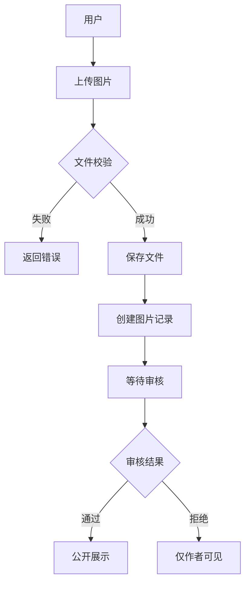

#### 8.3.2 用户认证流程

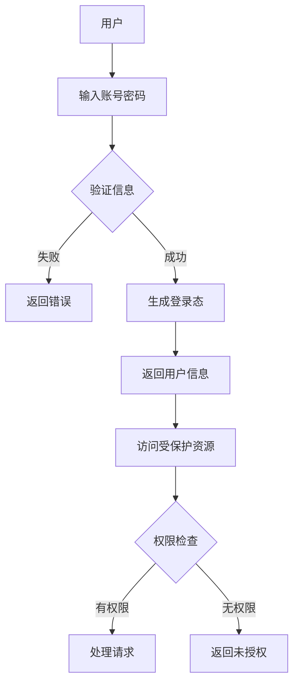

#### 8.3.3 图片审核流程

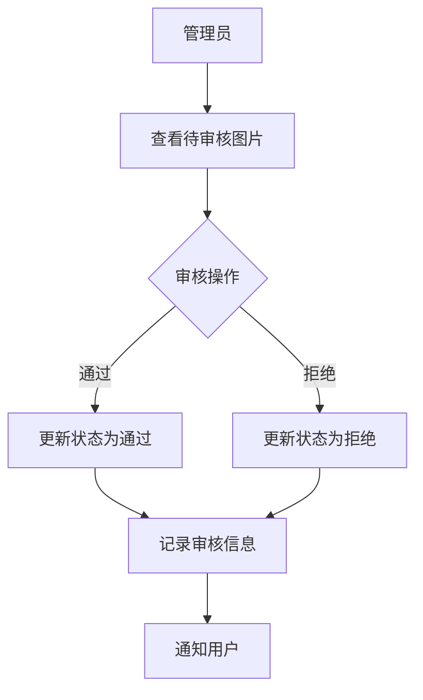

## 9. 图片模块详细业务流程

### 9.1 数据结构

#### 9.1.1 核心实体（Picture）

```java
public class Picture {
    private Long id;                // 图片ID
    private String url;            // 图片URL
    private String name;           // 图片名称
    private String introduction;   // 图片简介
    private String category;       // 分类
    private String tags;          // 标签（JSON数组）
    private Long picSize;         // 图片大小
    private Integer picWidth;     // 宽度
    private Integer picHeight;    // 高度
    private Double picScale;      // 宽高比
    private String picFormat;     // 图片格式
    private Long userId;          // 创建用户ID
    private Integer reviewStatus; // 审核状态（0-待审核,1-通过,2-拒绝）
    private String reviewMessage; // 审核信息
    private Long reviewerId;      // 审核人ID
    private Date reviewTime;      // 审核时间
    private Date createTime;      // 创建时间
    private Date editTime;        // 编辑时间
    private Date updateTime;      // 更新时间
}
```

### 9.2 详细业务流程

#### 9.2.1 图片上传流程

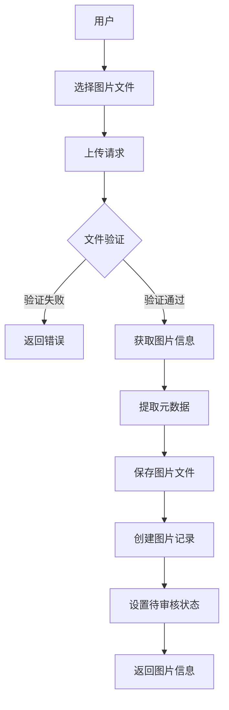

**详细步骤**：

1. **文件验证**

   - 检查文件大小
   - 验证文件格式
   - 校验文件完整性

2. **元数据提取**

   - 获取图片尺寸
   - 计算宽高比
   - 获取文件格式
   - 记录文件大小

3. **数据存储**
   - 保存图片文件到存储系统
   - 生成访问 URL
   - 创建数据库记录

#### 9.2.2 图片审核流程

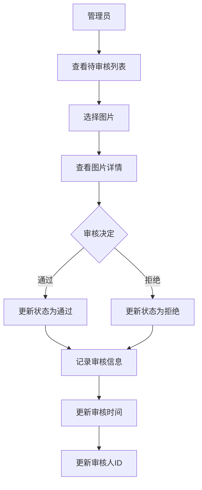

**审核状态流转**：

- 待审核(0) -> 通过(1)
- 待审核(0) -> 拒绝(2)

#### 9.2.3 图片管理流程

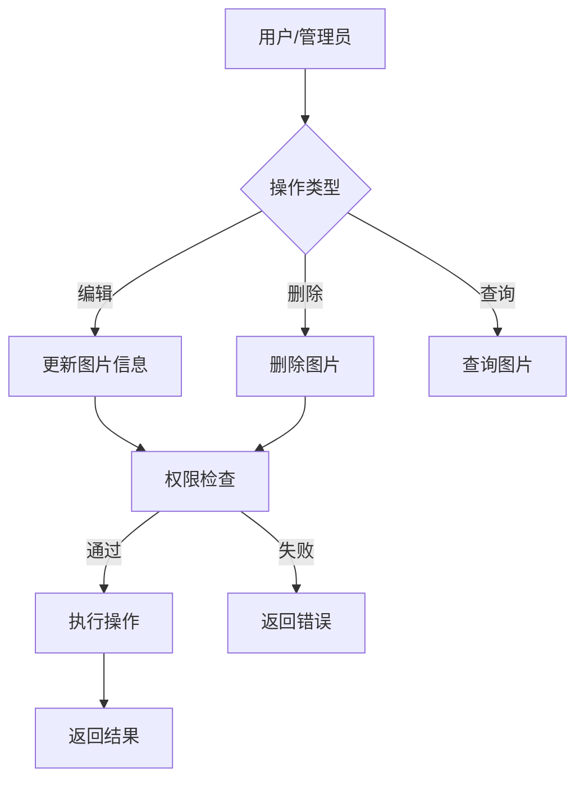

**权限控制**：

1. 普通用户
   - 只能操作自己的图片
   - 只能查看已审核通过的图片
2. 管理员
   - 可以操作所有图片
   - 可以查看所有状态的图片

#### 9.2.4 图片查询流程

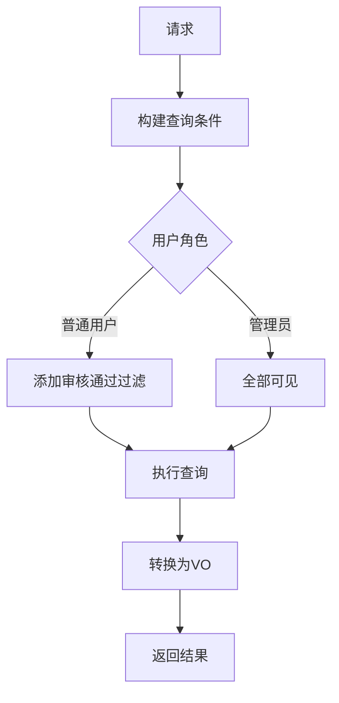

**查询参数**：

- 分类筛选
- 标签筛选
- 创建时间范围
- 审核状态
- 关键词搜索

### 9.3 关键业务规则

1. **图片格式控制**

   - 支持的格式：JPG、PNG、GIF 等
   - 最大文件大小限制
   - 图片尺寸限制

2. **审核机制**

   - 所有上传图片默认待审核
   - 只有管理员可以进行审核
   - 审核需要记录操作人和时间

3. **权限控制**

   - 基于用户角色的访问控制
   - 操作权限验证
   - 数据访问范围控制

4. **数据展示**
   - 分页查询
   - 条件过滤
   - 排序支持

### 9.4 异常处理

1. **上传异常**

   - 文件格式错误
   - 文件大小超限
   - 存储失败

2. **业务异常**

   - 权限不足
   - 资源不存在
   - 参数错误

3. **系统异常**
   - 服务器错误
   - 存储系统异常
   - 数据库异常

### 优化点

1. 图片查询优化：
   - redis 缓存优化
   - 本地缓存优化(等待实现)

## 10. WebSocket 模块详细业务流程

### 10.1 WebSocket 架构概述

项目中的 WebSocket 模块主要用于实现图片协同编辑功能，允许多个用户同时查看和编辑同一张图片，并实时同步编辑操作。

#### 10.1.1 核心组件

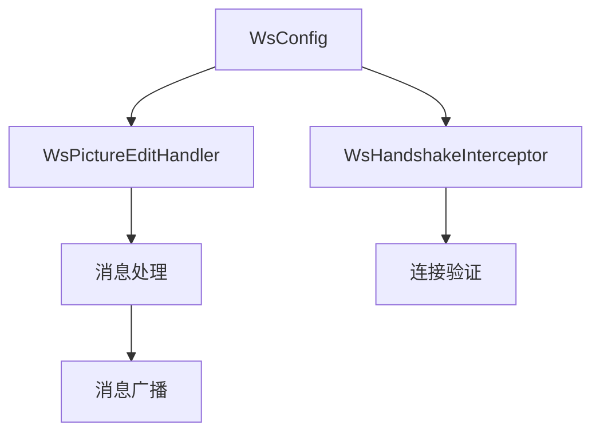

1. **WsConfig**: WebSocket 配置类，注册处理器和拦截器
2. **WsHandshakeInterceptor**: 握手拦截器，负责连接验证和权限检查
3. **WsPictureEditHandler**: 消息处理器，处理各类编辑操作和状态管理

### 10.2 数据模型

#### 10.2.1 消息类型枚举 (PictureEditMessageTypeEnum)

```java
public enum PictureEditMessageTypeEnum {
    INFO("发送通知", "INFO"),
    ERROR("发送错误", "ERROR"),
    ENTER_EDIT("进入编辑状态", "ENTER_EDIT"),
    EXIT_EDIT("退出编辑状态", "EXIT_EDIT"),
    EDIT_ACTION("执行编辑操作", "EDIT_ACTION");
}
```

#### 10.2.2 编辑操作枚举 (PictureEditActionEnum)

```java
public enum PictureEditActionEnum {
    ZOOM_IN("放大操作", "ZOOM_IN"),
    ZOOM_OUT("缩小操作", "ZOOM_OUT"),
    ROTATE_LEFT("左旋操作", "ROTATE_LEFT"),
    ROTATE_RIGHT("右旋操作", "ROTATE_RIGHT");
}
```

#### 10.2.3 请求消息 (PictureEditRequestMessage)

```java
public class PictureEditRequestMessage {
    private String type;       // 消息类型
    private String editAction; // 编辑动作
}
```

#### 10.2.4 响应消息 (PictureEditResponseMessage)

```java
public class PictureEditResponseMessage {
    private String type;       // 消息类型
    private String message;    // 消息内容
    private String editAction; // 编辑动作
    private UserVo user;       // 用户信息
}
```

### 10.3 WebSocket 通信流程

#### 10.3.1 连接建立流程

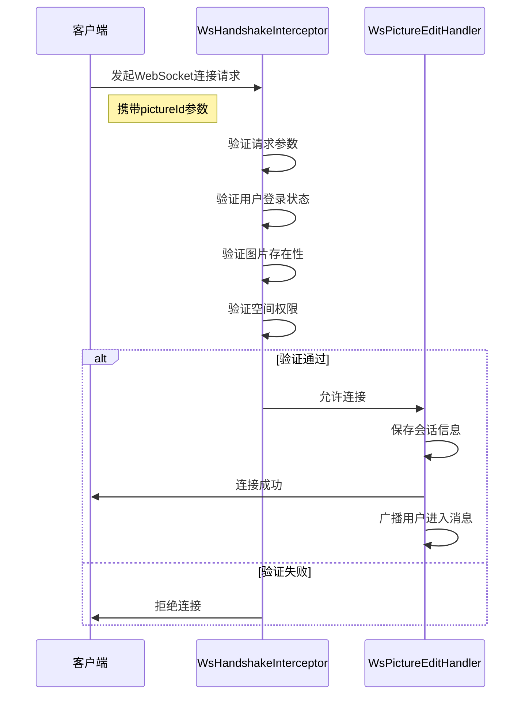

#### 10.3.2 消息处理流程

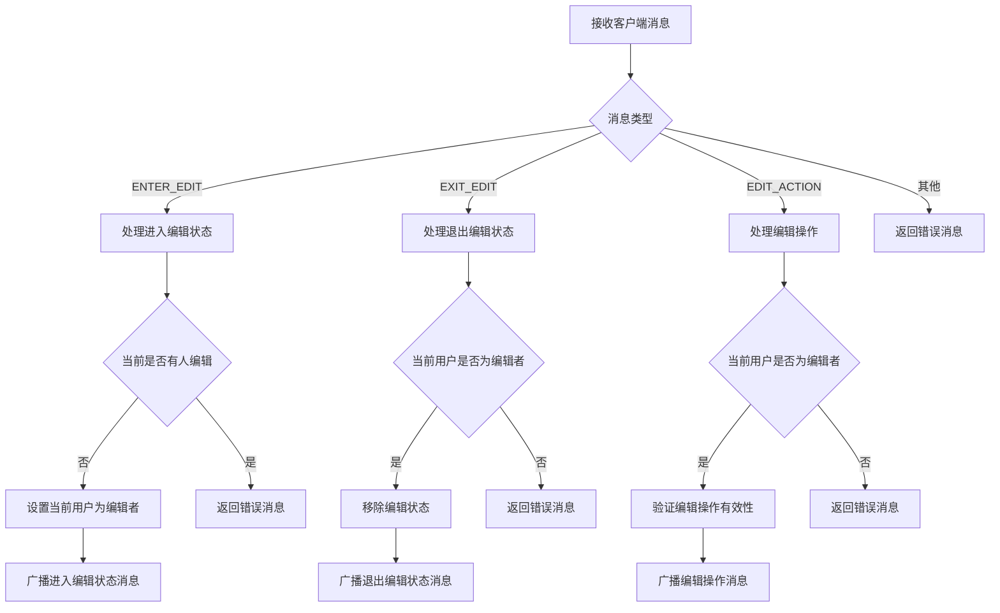

#### 10.3.3 广播机制

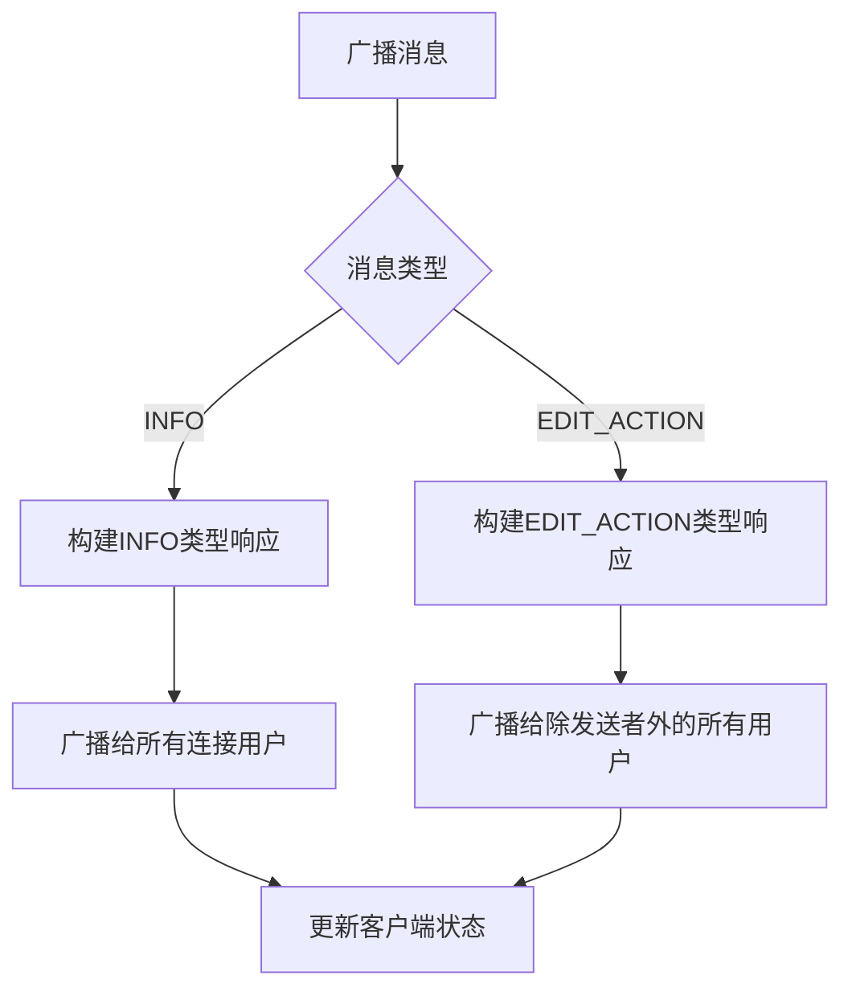

#### 10.3.4 连接关闭流程

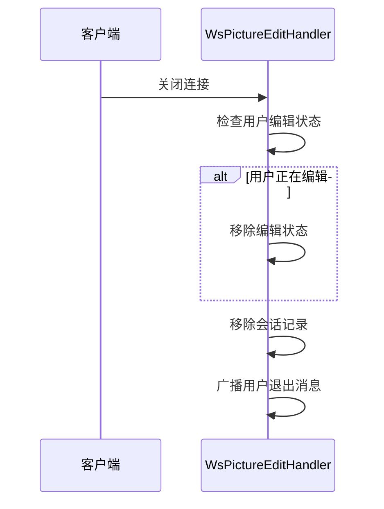

### 10.4 状态管理

#### 10.4.1 会话管理

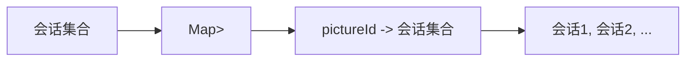

#### 10.4.2 编辑状态管理

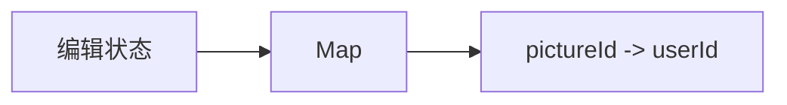

### 10.5 并发控制

项目采用了以下机制确保在多用户同时编辑时的数据一致性：

1. **单一编辑者模式**：同一时间只允许一个用户对图片进行编辑操作
2. **ConcurrentHashMap**：使用线程安全的集合类存储会话和状态信息
3. **状态锁定机制**：用户进入编辑状态后，其他用户无法执行编辑操作

### 10.6 异常处理

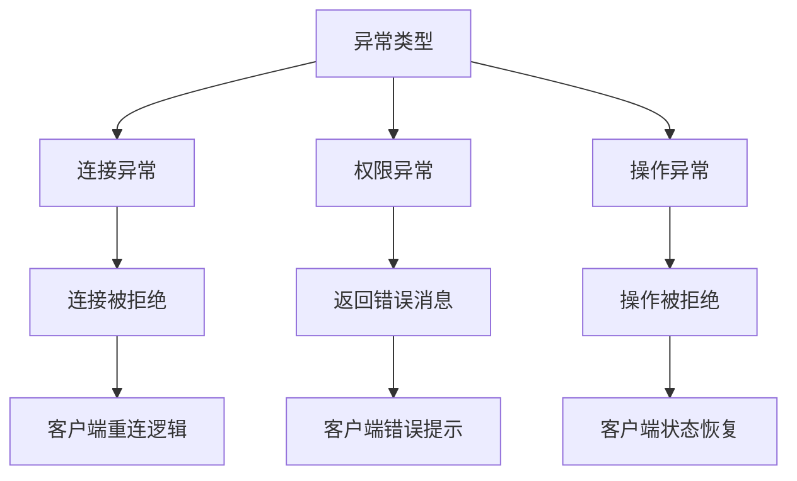

### 10.7 完整通信流程

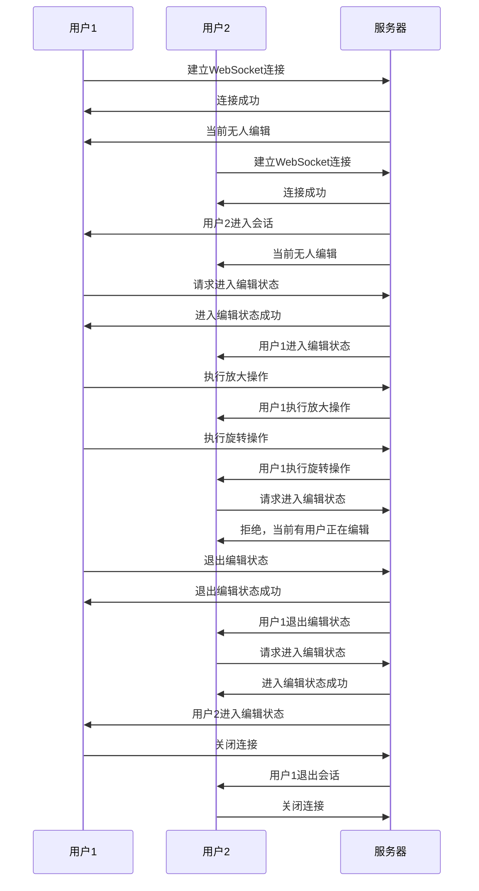

### 10.8 优化建议

1. **重连机制**：

   - 实现客户端断线重连功能
   - 保存断线前的编辑状态

2. **编辑锁超时**：

   - 添加编辑状态超时机制
   - 长时间无操作自动释放编辑权限

3. **操作合并**：

   - 对频繁的小操作进行合并
   - 减少消息传输次数

4. **消息压缩**：
   - 对大型编辑操作的消息进行压缩
   - 优化网络传输效率

## 11. 图片模块详细消息流转与业务流程

### 11.1 图片上传流程详解

#### 11.1.1 请求-响应流程

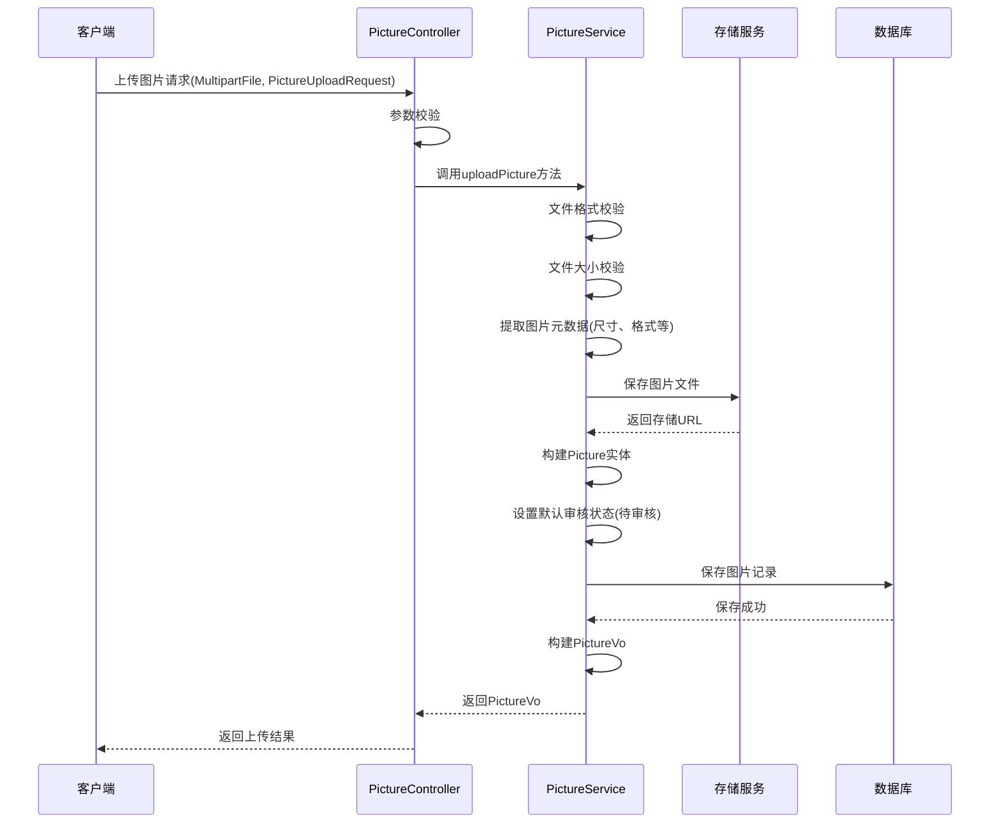

#### 11.1.2 数据转换流程

```mermaid
flowchart TD
    A[客户端请求] --> B[MultipartFile]
    A --> C[PictureUploadRequest]

    B --> D[文件处理]
    C --> E[参数提取]

    D --> F[图片元数据]
    E --> G[业务参数]

    F --> H[Picture实体]
    G --> H

    H --> I[数据库存储]
    I --> J[Picture实体]

    J --> K[PictureVo转换]
    K --> L[响应结果]
```

#### 11.1.3 异常处理流程

```mermaid
flowchart TD
    A[上传请求] --> B{参数校验}
    B -->|失败| C[抛出PARAMS_ERROR]
    B -->|成功| D{文件校验}

    D -->|失败| E[抛出PARAMS_ERROR]
    D -->|成功| F{存储操作}

    F -->|失败| G[抛出SYSTEM_ERROR]
    F -->|成功| H{数据库操作}

    H -->|失败| I[抛出OPERATION_ERROR]
    H -->|成功| J[返回成功结果]

    C --> K[统一异常处理]
    E --> K
    G --> K
    I --> K

    K --> L[返回错误响应]
```

### 11.2 图片审核流程详解

#### 11.2.1 请求-响应流程

```mermaid
sequenceDiagram
    participant Admin as 管理员
    participant Controller as PictureController
    participant Service as PictureService
    participant DB as 数据库

    Admin->>Controller: 审核请求(PictureReviewRequest)
    Controller->>Controller: 权限校验(@AuthCheck)
    Controller->>Controller: 参数校验

    Controller->>Service: 调用reviewPicture方法

    Service->>DB: 查询图片信息
    DB-->>Service: 返回图片数据

    Service->>Service: 验证图片状态
    Service->>Service: 设置审核状态
    Service->>Service: 设置审核信息
    Service->>Service: 设置审核时间
    Service->>Service: 设置审核人ID

    Service->>DB: 更新图片记录
    DB-->>Service: 更新成功

    Service-->>Controller: 返回处理结果
    Controller-->>Admin: 返回审核结果
```

#### 11.2.2 状态转换流程

```mermaid
stateDiagram-v2
    [*] --> 待审核: 图片上传
    待审核 --> 审核通过: 管理员审核通过
    待审核 --> 审核拒绝: 管理员审核拒绝

    审核通过 --> [*]: 结束流程
    审核拒绝 --> [*]: 结束流程

    state 待审核 {
        [*] --> 等待管理员操作
        等待管理员操作 --> 查看详情
        查看详情 --> 做出决定
        做出决定 --> [*]
    }
```

#### 11.2.3 审核决策流程

```mermaid
flowchart TD
    A[审核请求] --> B{权限检查}
    B -->|非管理员| C[拒绝操作]
    B -->|管理员| D[获取图片信息]

    D --> E{图片是否存在}
    E -->|否| F[返回NOT_FOUND]
    E -->|是| G{当前状态}

    G -->|非待审核| H[状态错误]
    G -->|待审核| I{审核决定}

    I -->|通过| J[设置状态为通过]
    I -->|拒绝| K[设置状态为拒绝]

    J --> L[记录审核信息]
    K --> L

    L --> M[更新数据库]
    M --> N[返回审核结果]
```

### 11.3 图片查询流程详解

#### 11.3.1 请求-响应流程

```mermaid
sequenceDiagram
    participant Client as 客户端
    participant Controller as PictureController
    participant Service as PictureService
    participant DB as 数据库

    Client->>Controller: 查询请求(PictureQueryRequest)
    Controller->>Controller: 参数校验

    alt 普通用户
        Controller->>Controller: 设置只查询审核通过的图片
    end

    Controller->>Service: 构建查询条件
    Service->>Service: 创建QueryWrapper
    Service->>Service: 添加过滤条件

    Service->>DB: 执行分页查询
    DB-->>Service: 返回图片列表

    Service->>Service: 转换为PictureVo列表
    Service-->>Controller: 返回分页结果
    Controller-->>Client: 返回查询结果
```

#### 11.3.2 查询条件构建流程

```mermaid
flowchart TD
    A[查询请求] --> B[提取查询参数]

    B --> C[创建QueryWrapper]

    C --> D{是否有关键词}
    D -->|是| E[添加关键词条件]

    C --> F{是否有标签}
    F -->|是| G[添加标签条件]

    C --> H{是否有分类}
    H -->|是| I[添加分类条件]

    C --> J{是否有时间范围}
    J -->|是| K[添加时间条件]

    C --> L{是否有审核状态}
    L -->|是| M[添加状态条件]
    L -->|否| N[普通用户默认只查审核通过]

    E --> O[最终查询条件]
    G --> O
    I --> O
    K --> O
    M --> O
    N --> O

    O --> P[执行查询]
```

#### 11.3.3 数据转换流程

```mermaid
flowchart TD
    A[数据库结果] --> B[Picture实体列表]

    B --> C[循环处理]

    C --> D[单个Picture实体]
    D --> E[创建PictureVo]

    E --> F[复制基本属性]
    E --> G[处理标签JSON]
    E --> H[添加用户信息]

    F --> I[PictureVo对象]
    G --> I
    H --> I

    I --> J[PictureVo列表]

    J --> K[构建分页结果]
    K --> L[最终响应]
```

### 11.4 图片编辑流程详解

#### 11.4.1 请求-响应流程

```mermaid
sequenceDiagram
    participant Client as 客户端
    participant Controller as PictureController
    participant Service as PictureService
    participant DB as 数据库

    Client->>Controller: 编辑请求(PictureEditRequest)
    Controller->>Controller: 参数校验

    Controller->>Service: 转换为Picture实体
    Service->>Service: 验证图片数据

    Controller->>DB: 查询原图片信息
    DB-->>Controller: 返回原图片数据

    Controller->>Controller: 权限校验(本人或管理员)

    Controller->>Service: 设置审核参数
    Service->>Service: 设置编辑时间
    Service->>Service: 重置审核状态

    Controller->>DB: 更新图片记录
    DB-->>Controller: 更新成功

    Controller-->>Client: 返回编辑结果
```

#### 11.4.2 权限控制流程

```mermaid
flowchart TD
    A[编辑请求] --> B[获取登录用户]
    B --> C[获取原图片信息]

    C --> D{图片是否存在}
    D -->|否| E[返回NOT_FOUND]
    D -->|是| F{权限检查}

    F --> G{是创建者?}
    F --> H{是管理员?}

    G -->|是| I[允许编辑]
    H -->|是| I

    G -->|否| J{是管理员?}
    J -->|否| K[返回NO_AUTH]
    J -->|是| I

    I --> L[执行编辑操作]
    L --> M[返回编辑结果]
```

#### 11.4.3 编辑后状态处理

```mermaid
stateDiagram-v2
    [*] --> 编辑前状态

    编辑前状态 --> 编辑操作: 用户编辑

    编辑操作 --> 待审核状态: 普通用户编辑
    编辑操作 --> 保持原状态: 管理员编辑

    待审核状态 --> 审核流程: 等待审核
    保持原状态 --> [*]: 结束流程

    审核流程 --> [*]: 结束流程
```

### 11.5 图片删除流程详解

#### 11.5.1 请求-响应流程

```mermaid
sequenceDiagram
    participant Client as 客户端
    participant Controller as PictureController
    participant Service as PictureService
    participant DB as 数据库

    Client->>Controller: 删除请求(IdRequest)
    Controller->>Controller: 参数校验

    Controller->>DB: 查询图片信息
    DB-->>Controller: 返回图片数据

    Controller->>Controller: 权限校验(本人或管理员)

    alt 逻辑删除
        Controller->>DB: 更新isDelete标志
    else 物理删除
        Controller->>DB: 删除图片记录
    end

    DB-->>Controller: 删除成功
    Controller-->>Client: 返回删除结果
```

#### 11.5.2 删除权限控制

```mermaid
flowchart TD
    A[删除请求] --> B[参数校验]
    B -->|失败| C[返回PARAMS_ERROR]
    B -->|成功| D[查询图片信息]

    D --> E{图片是否存在}
    E -->|否| F[返回NOT_FOUND]
    E -->|是| G[获取登录用户]

    G --> H{权限检查}
    H --> I{是创建者?}
    H --> J{是管理员?}

    I -->|是| K[允许删除]
    J -->|是| K

    I -->|否| L{是管理员?}
    L -->|否| M[返回NO_AUTH]
    L -->|是| K

    K --> N[执行删除操作]
    N --> O[返回删除结果]
```

### 11.6 图片标签和分类管理

#### 11.6.1 标签分类数据流

```mermaid
flowchart TD
    A[客户端请求] --> B[获取标签和分类]

    B --> C[PictureController]
    C --> D[构建PictureTagCategory]

    D --> E[设置标签列表]
    D --> F[设置分类列表]

    E --> G[PictureTagCategory对象]
    F --> G

    G --> H[返回响应]
```

#### 11.6.2 标签使用流程

```mermaid
sequenceDiagram
    participant Client as 客户端
    participant Controller as PictureController
    participant Service as PictureService

    Client->>Controller: 获取标签分类
    Controller->>Controller: 构建标签分类数据
    Controller-->>Client: 返回标签分类

    Client->>Client: 用户选择标签

    Client->>Controller: 上传/编辑图片(带标签)
    Controller->>Service: 处理图片
    Service->>Service: 保存标签(JSON格式)
    Service-->>Controller: 返回处理结果
    Controller-->>Client: 返回操作结果
```

### 11.7 图片模块消息流转总结

```mermaid
graph TD
    A[客户端] --> B[HTTP请求]
    B --> C[Controller层]

    C --> D[参数校验]
    D --> E[权限校验]
    E --> F[业务处理]

    F --> G[Service层]
    G --> H[数据处理]
    H --> I[存储交互]

    I --> J[数据库]
    I --> K[文件存储]

    J --> L[数据返回]
    K --> L

    L --> M[数据转换]
    M --> N[响应构建]

    N --> O[HTTP响应]
    O --> P[客户端]

    style A fill:#f9f,stroke:#333,stroke-width:2px
    style P fill:#f9f,stroke:#333,stroke-width:2px
    style C fill:#bbf,stroke:#333,stroke-width:2px
    style G fill:#bbf,stroke:#333,stroke-width:2px
    style J fill:#bfb,stroke:#333,stroke-width:2px
    style K fill:#bfb,stroke:#333,stroke-width:2px
```

### 11.8 优化建议

1. **缓存优化**：

   - 热门图片缓存
   - 标签分类缓存
   - 查询结果缓存

2. **批量操作**：

   - 批量审核功能
   - 批量标签管理
   - 批量删除功能

3. **性能优化**：

   - 图片压缩处理
   - 图片懒加载
   - 分布式存储

4. **用户体验**：
   - 图片预览功能
   - 拖拽上传支持
   - 进度条显示
